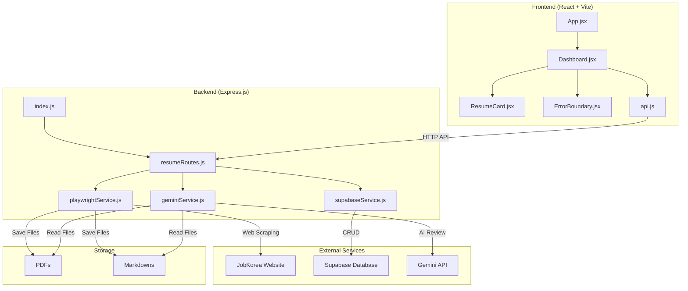
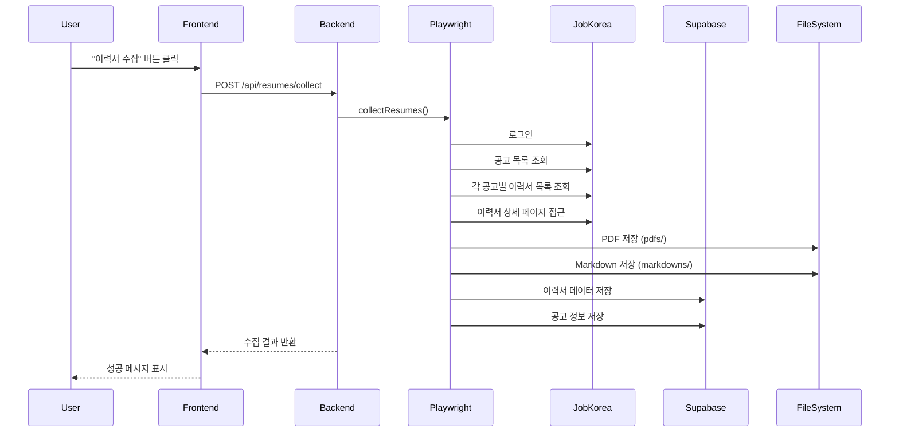
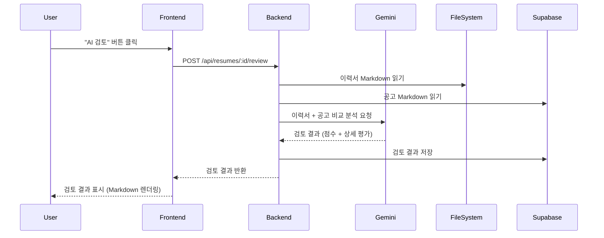
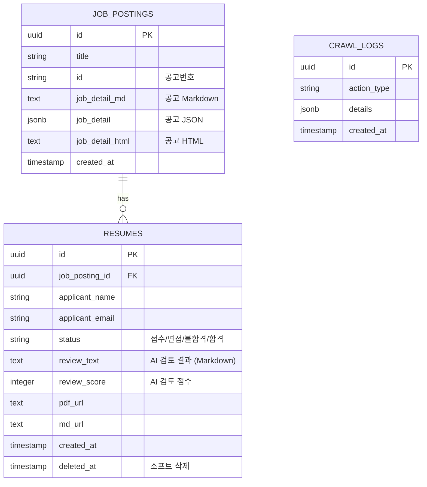

# 🏗️ 잡코리아 이력서 관리 시스템 - 앱 구조

## 📊 전체 시스템 아키텍처



## 📁 디렉토리 구조

```
jobkorea/
├── frontend/                    # React 프론트엔드
│   ├── src/
│   │   ├── App.jsx             # 메인 앱 컴포넌트 (라우팅)
│   │   ├── pages/
│   │   │   └── Dashboard.jsx   # 대시보드 (이력서 목록, 필터링, 상태 관리)
│   │   ├── components/
│   │   │   ├── ResumeCard.jsx  # 이력서 카드 컴포넌트
│   │   │   └── ErrorBoundary.jsx # 에러 처리
│   │   └── services/
│   │       └── api.js          # API 클라이언트
│   └── package.json
│
├── backend-new/                 # Express 백엔드
│   ├── src/
│   │   ├── index.js            # Express 서버 진입점
│   │   ├── routes/
│   │   │   └── resumeRoutes.js # 이력서 관련 API 엔드포인트
│   │   ├── services/
│   │   │   ├── playwrightService.js  # 웹 스크래핑 (Playwright)
│   │   │   ├── supabaseService.js    # 데이터베이스 작업
│   │   │   └── geminiService.js      # AI 이력서 검토
│   │   └── utils/
│   │       └── selectors.js    # CSS 셀렉터 정의
│   ├── pdfs/                   # 생성된 PDF 파일 저장
│   ├── markdowns/              # 생성된 Markdown 파일 저장
│   └── package.json
│
└── backup/                     # 백업 및 마이그레이션 파일
    ├── supabase/              # SQL 마이그레이션 파일
    └── md/                    # 문서 백업
```

## 🔄 데이터 흐름

### 1. 이력서 수집 프로세스



### 2. AI 이력서 검토 프로세스



## 🗄️ 데이터베이스 스키마



## 🔌 API 엔드포인트

### 이력서 관련
- `GET /api/resumes` - 이력서 목록 조회 (필터링 지원)
- `POST /api/resumes/collect` - 이력서 수집 실행
- `PATCH /api/resumes/:id/status` - 이력서 상태 업데이트
- `POST /api/resumes/:id/review` - AI 이력서 검토
- `DELETE /api/resumes/:id` - 이력서 소프트 삭제
- `POST /api/resumes/:id/restore` - 이력서 복원
- `DELETE /api/resumes/:id/permanent` - 이력서 영구 삭제
- `GET /api/resumes/pdf/:filename` - PDF 다운로드

### 공고 관련
- `GET /api/resumes/job-postings` - 공고 목록 조회
- `GET /api/resumes/job-postings/:jobPostingId/markdown` - 공고 Markdown 조회

## 🎨 주요 컴포넌트

### Frontend

#### Dashboard.jsx
- **역할**: 메인 대시보드 페이지
- **기능**:
  - 공고 목록 탭 (공고 조회 및 Markdown 상세보기)
  - 이력서 목록 탭 (카드형/테이블형 뷰)
  - 필터링 (상태, 공고명, 공고번호, 지원자명)
  - 상태 관리 (접수/면접/불합격/합격)
  - 일괄 선택 및 상태 변경
  - 이력서 수집 트리거
  - 통계 표시
  - 다크 모드 토글
  - 페이지네이션

#### ResumeCard.jsx
- **역할**: 개별 이력서 카드 컴포넌트
- **기능**:
  - 이력서 정보 표시
  - AI 검토 결과 렌더링 (ReactMarkdown)
  - 상태 변경 UI
  - PDF/Markdown 다운로드
  - 삭제/복원 기능

### Backend

#### playwrightService.js
- **역할**: 웹 스크래핑 서비스
- **주요 함수**:
  - `collectResumes()`: 전체 수집 프로세스
  - `collectJobPostings()`: 공고 목록 수집
  - `collectResumesFromJobPosting()`: 공고별 이력서 수집 (순차 처리)
  - `processResumeSequentially()`: 개별 이력서 처리
  - `extractResumeData()`: 이력서 데이터 추출
  - `extractJobPostingMarkdown()`: 공고 상세 정보 추출

#### geminiService.js
- **역할**: AI 이력서 검토 서비스
- **주요 함수**:
  - `reviewResume()`: 이력서 + 공고 비교 분석

#### supabaseService.js
- **역할**: 데이터베이스 작업
- **주요 함수**:
  - `getResumes()`: 이력서 조회 (필터링 지원)
  - `saveResume()`: 이력서 저장
  - `updateResumeStatus()`: 상태 업데이트
  - `updateResumeReviewScore()`: 검토 결과 저장
  - `getJobPostings()`: 공고 목록 조회
  - `getJobPostingMarkdown()`: 공고 Markdown 조회
  - `softDeleteResume()`: 소프트 삭제
  - `restoreResume()`: 복원
  - `permanentDeleteResume()`: 영구 삭제

## 🔐 환경 변수

### Backend (.env)
```
JOBKOREA_ID=your_company_id
JOBKOREA_PW=your_password
SUPABASE_URL=https://your-project.supabase.co
SUPABASE_ANON_KEY=your_anon_key
GEMINI_API_KEY=your_gemini_api_key
PORT=4001
```

## 🚀 실행 흐름

1. **서버 시작**
   ```bash
   start_all.bat  # 백엔드(4001) + 프론트엔드(5173) 시작
   ```

2. **이력서 수집**
   - 사용자가 "이력서 수집" 버튼 클릭
   - Playwright가 JobKorea에 로그인
   - 공고 목록 → 각 공고별 이력서 수집
   - PDF/Markdown 생성 및 Supabase 저장

3. **AI 검토**
   - 사용자가 "AI 검토" 버튼 클릭
   - Gemini API로 이력서 + 공고 비교 분석
   - 결과를 Markdown으로 저장 및 표시

4. **상태 관리**
   - 사용자가 이력서 상태 변경 (접수/면접/불합격/합격)
   - Supabase에 상태 업데이트

## 📝 주요 기술 스택

- **Frontend**: React 18, Vite, Tailwind CSS, React Router, ReactMarkdown, Lucide Icons, date-fns
- **Backend**: Node.js, Express.js, Playwright, Cheerio, pdf-parse, turndown
- **Database**: Supabase (PostgreSQL)
- **AI**: Google Gemini 2.0 Flash (gemini-2.0-flash-exp)
- **File Storage**: 로컬 파일 시스템 (PDFs, Markdowns)
- **Development**: nodemon, ESLint


